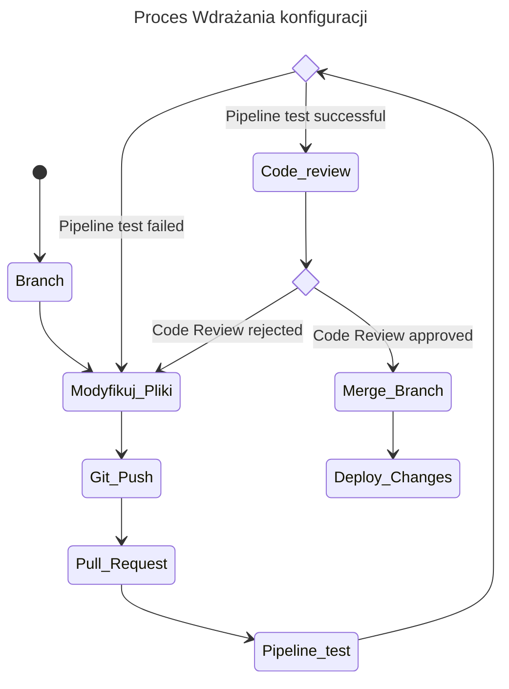

## GitOps workflow

GitOps jest to framework w którym repozytorium git traktowane jest jako źródło prawdy dla usług działających w naszym środowisku. Zgodnie z tym podejściem nie wprowadzamy żadnych zmian ręcznie. W przeciwnym wypadku nie zostaną one odtworzone jeśli będziemy chcieli przywrócić środowisko. Zmiany mogą zostać również nadpisane w trakcie wykonywania nowego wdrożenia.

<Catalog />